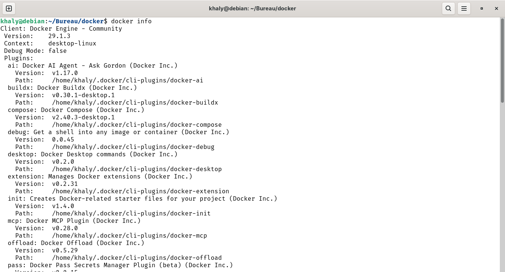
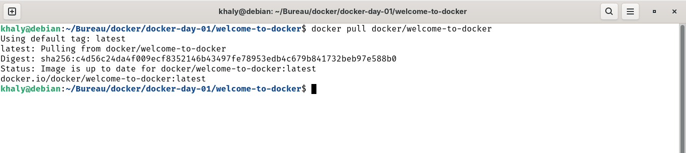
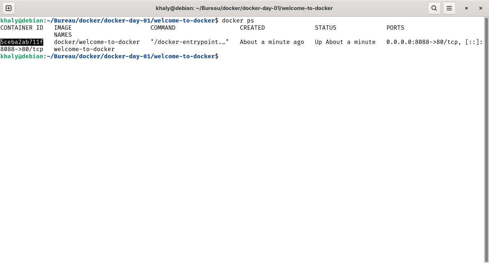
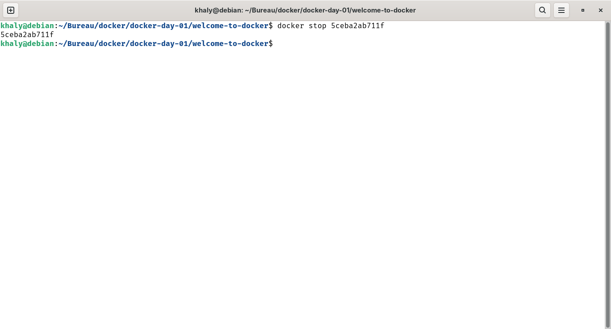

# Docker Jour 01 : Introduction aux bases de Docker

Ce tutoriel couvre les fondamentaux de Docker, y compris la vérification de l'installation et les commandes de base. Chaque section inclut une image représentative de la sortie de la commande.

## 1. Vérification de la version de Docker
Pour vérifier que Docker est installé, exécutez `docker --version`. Cela affiche la version installée.

## 2. Lister les infos 
Pour vérifier les infos, exécutez `docker info`. Cela affiche les infos.

## 3. Lister les images Docker
Utilisez `docker images` pour lister toutes les images disponibles sur votre système.

## 4. Tirer une image
Tirez une image depuis Docker Hub avec `docker pull <nom-image>`, par exemple `docker pull ubuntu`.

## 5. Exécuter un conteneur
Exécutez un conteneur en utilisant `docker run <nom-image>`, par exemple `docker run hello-world`.

## 6. Lister les conteneurs en cours d'exécution
Vérifiez les conteneurs en cours avec `docker ps`.

## 7. Arrêter un conteneur
Arrêtez un conteneur en utilisant `docker stop <id-conteneur>`.

## 8. Supprimer votre conteneur 
Spprimer un conteneur en utilisant `docker rm <nom-conteneur>`

## 9. Supprimer l'image Docker
Supprimer l'images `docker rmi <image>`

## 🔹 Exemples de lignes de commande pour la suppression

### Un conteneur spécifique 
`docker rm welcome-to-docker`

### Plusieurs conteneurs 
`docker rm conteneur1 conteneur2 conteneur3 `

### Tous les conteneurs arrêtés 
`docker container prune`

### Forcer la suppression d'un conteneur actif 
`docker rm -f <nom-conteneur>`

### Une image spécifique 
`docker rmi <image>`

### Plusieurs images 
`docker rmi image1 image2 image3`

### Toutes les images inutilisées 
`docker image prune`

### Toutes les images non utilisées 
`docker image prune -a`

### Forcer la suppression d'une image
`docker rmi -f <image>`

### Les erreurs rencontrées ci-dessus:
`docker run ` : on nous demandait de mettre un argument:
docker: 'docker run' requires at least 1 argument
Usage:  docker run [OPTIONS] IMAGE [COMMAND] [ARG...]
See 'docker run --help' for more information
#### correction:
`docker run -d -p 8088:80 --name welcome-to-docker docker/welcome-to-docker`

`docker stop `: encore un argument
docker: 'docker stop' requires at least 1 argument
Usage:  docker stop [OPTIONS] CONTAINER [CONTAINER...]
See 'docker stop --help' for more information
#### correction: 
`docker stop <ps_ID>`

`docker pull`:
docker: 'docker pull' requires 1 argument
Usage:  docker pull [OPTIONS] NAME[:TAG|@DIGEST]
Run 'docker pull --help' for more information
#### correction: 
`docker pull <nom>`
