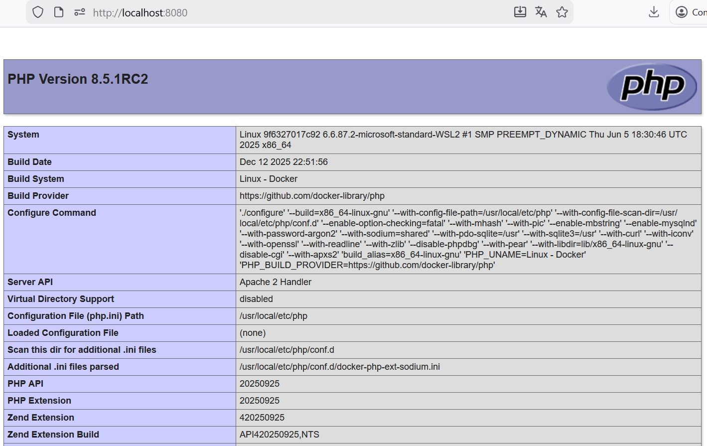

# PHP serveur APACHE info

## Pour demarer le projet :

tu build une image
`docker build -t phpinfo .`

tu le lances
`docker run -d -p 8080:80 phpinfo`

tu le verra sur le localhost
`http://localhost:8080`
