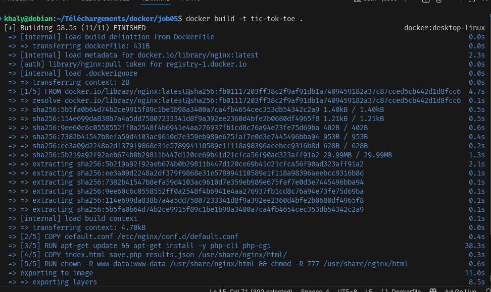
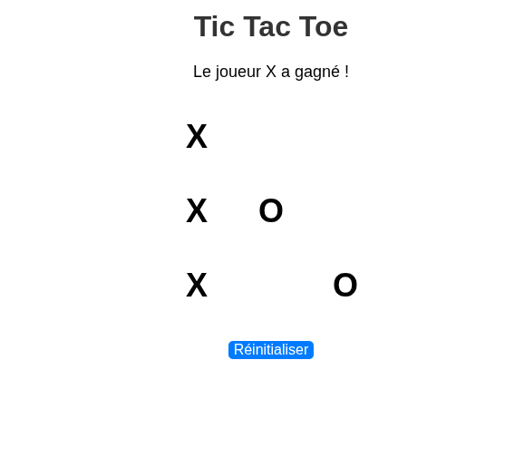
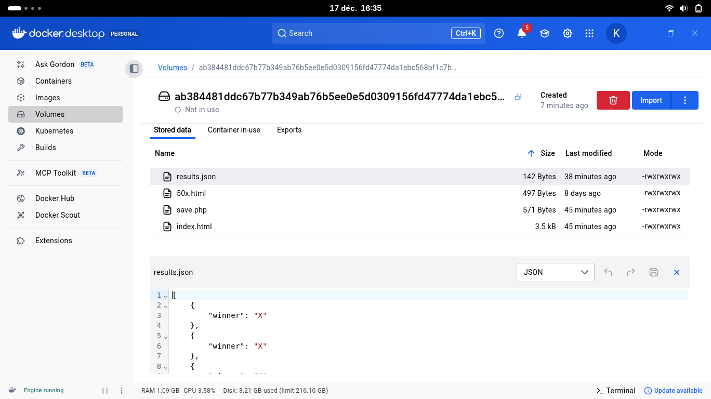

# PROJET TIC-TOC-TOE

## Creation des fichiers de base:
index.html
save.php
results.json

## Etapes pour realiser le projet:
default.conf: pour la configuration du lancement
Dockerfile: pour les instruction de buld de l'image
Faire un build de l'image `docker build -t image`

faire un Run `docker run -d -p 8080:80 --name tic-tac-toe tic-tok-toe`

## RENDU:

## VOLUME:
