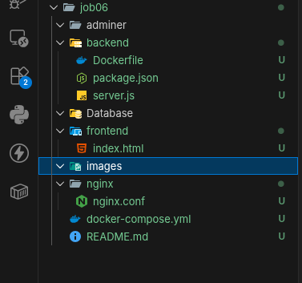
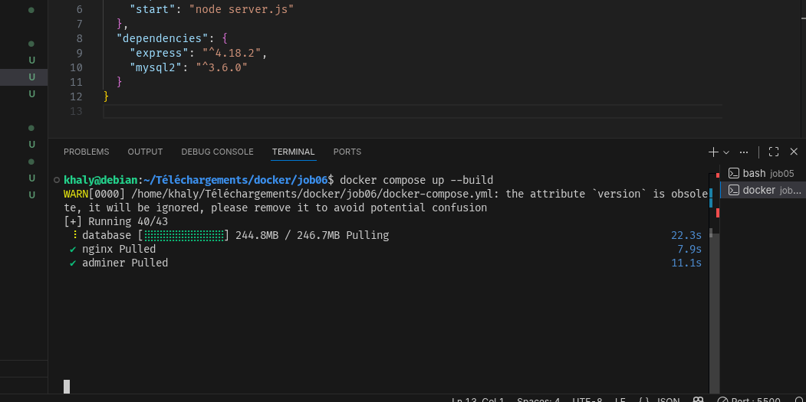
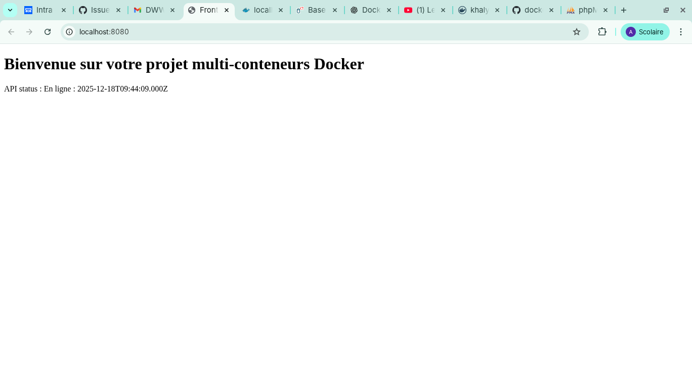
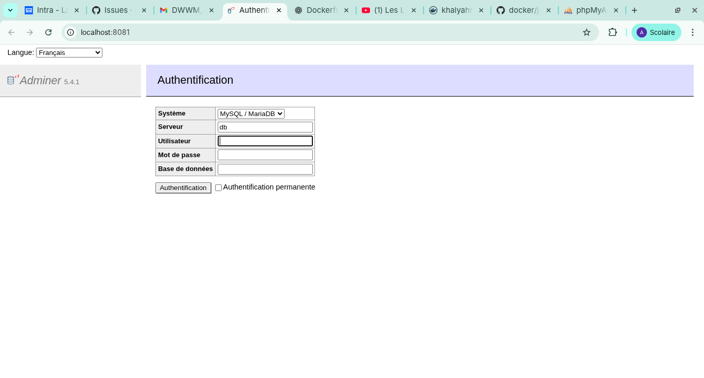
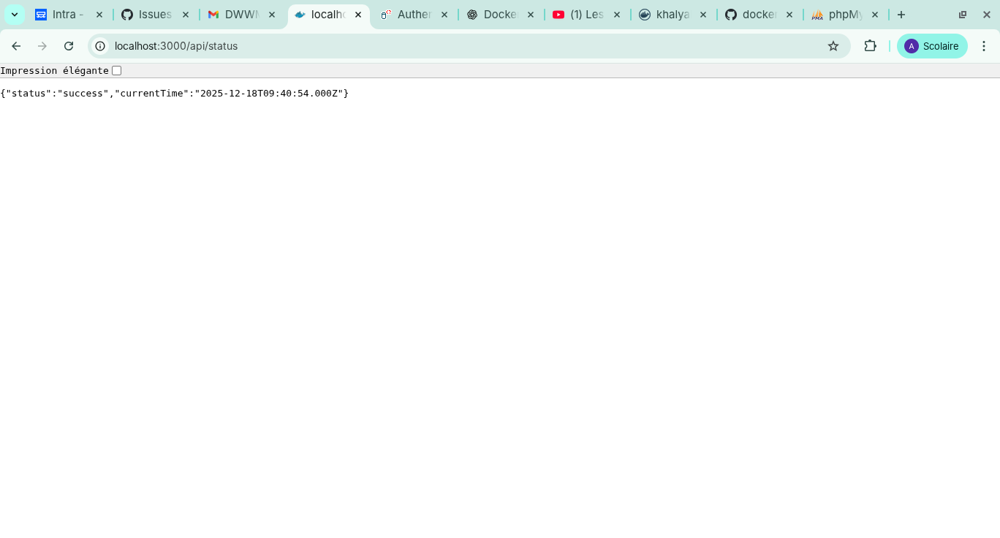
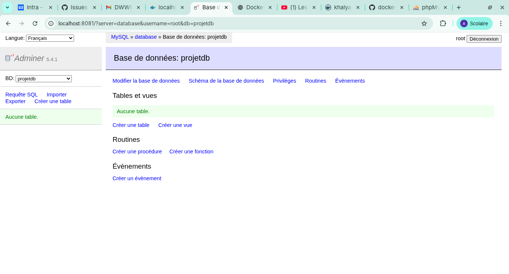

# DOCKER RESEAU 

## Creation de l'architecture du projet

## Redation du docker compose:

## Build le docker Compose: 

# Verification des liens

### Lien Accueil Front
` `

### Adminer 
`http://localhost:8081`

### API HOUR
`http://localhost:8080`

### Auth DATABASE

